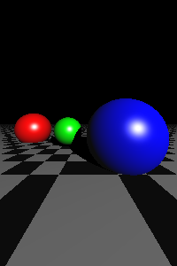

# Ray Tracing Engine

## Overview
This project implements a **Ray Tracing Engine** to render realistic 3D images by simulating the behavior of light. The engine calculates reflections, refractions, and shadows to create high-quality visuals.

### Key Features
- **Ray tracing** algorithm for realistic rendering.
- Supports **spheres, planes, and triangles** as scene objects.
- Implements **diffusivity, specular reflection, and recursion depth** for enhanced realism.
- Generates high-resolution images.
- **Configurable resolution and depth** for flexible rendering quality.

## Getting Started

### Prerequisites
Ensure you have **Python 3.x** installed along with the following dependencies:

```bash
pip install numpy matplotlib tqdm
```

### Running the Code
Execute the following command to generate a ray-traced image:

```bash
python ray_tracing_engine.py --width 1920 --height 1080 --depth 10
```

You can modify the resolution and recursion depth using command-line arguments.

## Implementation Details

### Ray Tracing Algorithm
The algorithm follows these steps:
1. **Ray Generation** – Casts rays from the camera into the scene.
2. **Intersection Tests** – Determines if a ray intersects with an object (plane, sphere, or triangle).
3. **Shading Model** – Applies lighting calculations using Lambert and Blinn-Phong shading.
4. **Reflection Handling** – Uses recursion for realistic reflections.
5. **Image Rendering** – Renders the final scene pixel by pixel.

### Example Output
Below is an example output of a rendered scene with depth = 10.



## Contributors
- **Shreyansh Goyal**
- **Prathyush Thunguri**
- **Anusha Mantha**
- **Tejaswi Pagadala**

## License
This project is licensed under the **Apache License 2.0**.

## Acknowledgments
This project was developed as part of the **ME735 course at IIT Bombay**, under the guidance of **Prof. S.S. Pande**.
