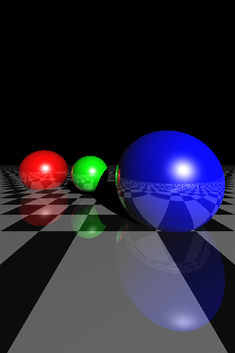
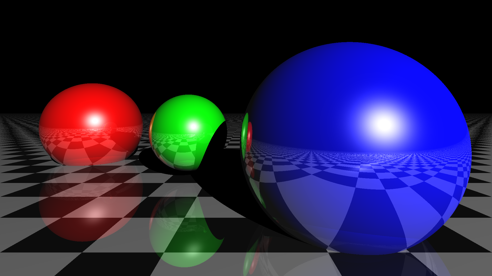
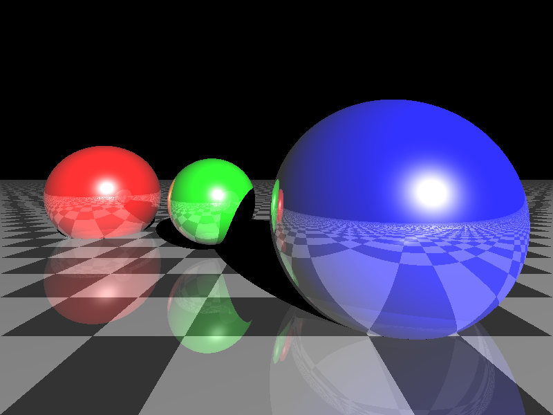
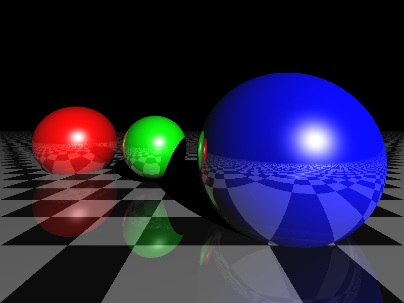
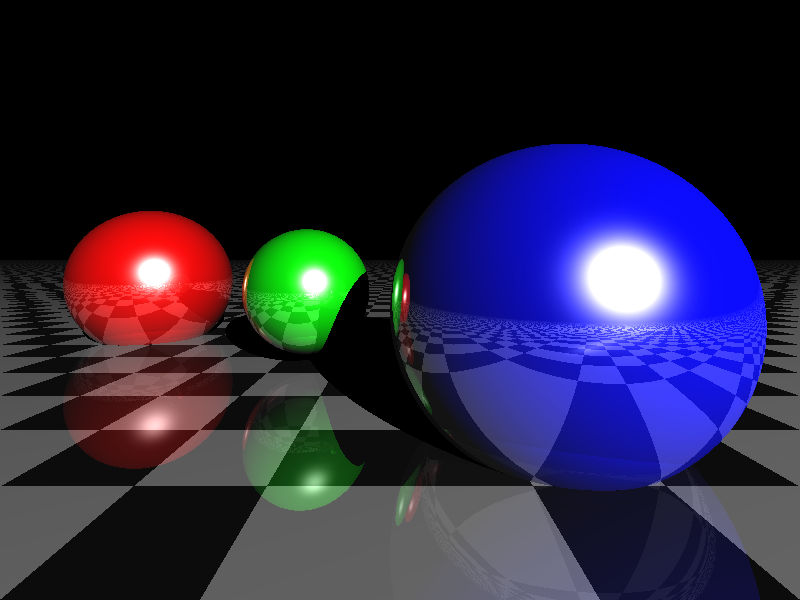
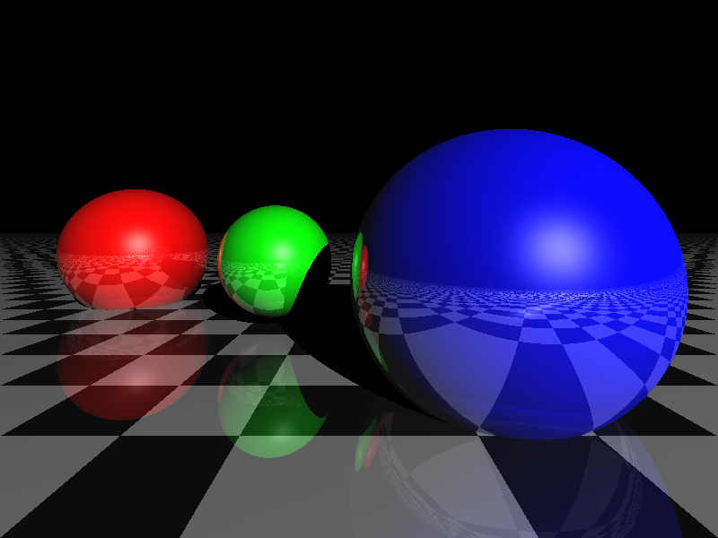

# Ray Tracing Engine

## Overview
This project implements a **Ray Tracing Engine** that renders realistic 3D images by simulating the behavior of light. The engine calculates reflections, refractions, and shadows to create high-quality visuals. The script is fully configurable, allowing users to customize resolution, depth, and lighting parameters through command-line arguments.

### Key Features
- **Ray tracing** algorithm for realistic rendering.
- Supports **spheres, planes, and triangles** as scene objects.
- Implements **diffusivity, specular reflection, and recursion depth** for enhanced realism.
- **Configurable resolution and depth** for flexible rendering quality.
- **Command-line arguments** to customize scene parameters easily.
- **Shadow calculations** for accurate scene realism.
- **Custom output filenames** for saving rendered images.

## Getting Started

### Prerequisites
Ensure you have **Python 3.x** installed along with the following dependencies:

```bash
pip install numpy matplotlib tqdm
```

### Running the Code
To generate a ray-traced image, execute:

```bash
python ray_tracing_engine.py --width 800 --height 600 --depth 10 --ambient 0.1 --diffuse 0.8 --specular 1.2 --specular_k 100 --output my_render.png
```

#### Available Arguments:
| Argument        | Description                                    | Default |
|--------------- |--------------------------------|---------|
| `--width`      | Width of the output image      | 200     |
| `--height`     | Height of the output image     | 300     |
| `--depth`      | Max number of light reflections | 5       |
| `--ambient`    | Ambient lighting intensity     | 0.05    |
| `--diffuse`    | Diffuse lighting coefficient   | 1.0     |
| `--specular`   | Specular lighting coefficient  | 1.0     |
| `--specular_k` | Specular exponent for reflection | 50      |
| `--output`     | Output file name               | output.png |

## Implementation Details

### Ray Tracing Algorithm
The algorithm follows these steps:
1. **Ray Generation** – Casts rays from the camera into the scene.
2. **Intersection Tests** – Determines if a ray intersects with an object (plane, sphere, or triangle).
3. **Shading Model** – Applies Lambert and Blinn-Phong shading for diffuse and specular lighting.
4. **Shadow Handling** – Checks for occlusion to simulate realistic shadows.
5. **Reflection Handling** – Uses recursion to trace reflections.
6. **Image Rendering** – Loops over each pixel and computes color values.

### Example Outputs
Below are example rendered scenes with different configurations, along with the commands used to generate them.

#### **1. Basic Scene with Default Settings**
```bash
python ray_tracing_engine.py --width 200 --height 300 --depth 5 --output basic_scene.png
```


#### **2. Higher Depth Reflections (Depth = 15)**
```bash
python ray_tracing_engine.py --width 400 --height 600 --depth 15 --output depth15_scene.png
```


🔹 *Comparison:* Increasing recursion depth results in more realistic reflections but increases computation time.

#### **3. Increased Resolution (1920x1080)**
```bash
python ray_tracing_engine.py --width 1920 --height 1080 --depth 10 --output high_res_scene.png
```


🔹 *Comparison:* Higher resolution provides more detail but takes longer to render.

#### **4. Effect of Ambient Light Intensity**
```bash
python ray_tracing_engine.py --width 800 --height 600 --depth 10 --ambient 0.2 --output ambient_high.png
python ray_tracing_engine.py --width 800 --height 600 --depth 10 --ambient 0.05 --output ambient_low.png
```
*Left: High Ambient Light (0.2) | Right: Low Ambient Light (0.05)*
<table>
  <tr>
    <td align="center"><b>High Ambient Light (0.2)</b></td>
    <td align="center"><b>Low Ambient Light (0.05)</b></td>
  </tr>
  <tr>
    <td></td>
    <td></td>
  </tr>
</table>

🔹 *Comparison:* Higher ambient lighting makes the scene brighter but reduces contrast.

#### **5. Effect of Specular Reflection**
```bash
python ray_tracing_engine.py --width 800 --height 600 --depth 10 --specular 2.0 --output specular_high.png
python ray_tracing_engine.py --width 800 --height 600 --depth 10 --specular 0.5 --output specular_low.png
```
*Left: High Specular (2.0) | Right: Low Specular (0.5)*

<table>
  <tr>
    <td align="center"><b>High Specular  (0.2)</b></td>
    <td align="center"><b>Low Specular  (0.5)</b></td>
  </tr>
  <tr>
    <td></td>
    <td></td>
  </tr>
</table>


🔹 *Comparison:* Higher specular values create sharper reflections, making surfaces appear shinier.
## Contributors
- **Shreyansh Goyal**
- **Prathyush Thunguri**
- **Anusha Mantha**
- **Tejaswi Pagadala**

## License
This project is licensed under the **Apache License 2.0**.

## Acknowledgments
This project was developed as part of the **ME735 course at IIT Bombay**, under the guidance of **Prof. S.S. Pande**.
